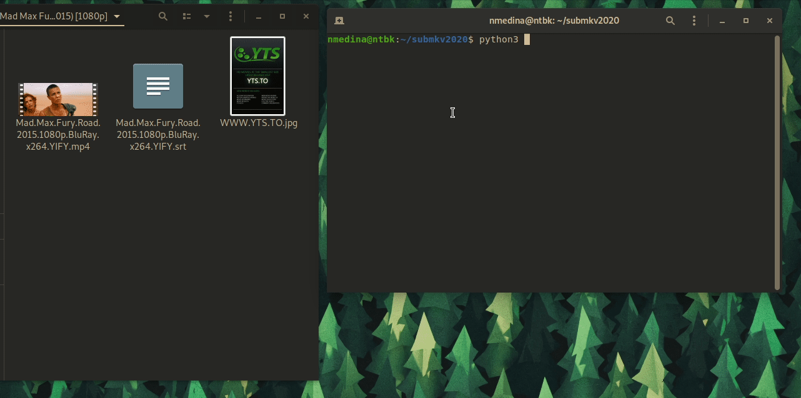

# submkv2020

_submkv2020 es una herramienta de subtitulado para archivos de video basada en el paquete ffmpeg y escrita en python_

_Está pensada para crear archivos multimedia que contengan subtitulos reconocibles en dispositivos que no reconocen subtitulos_

## Caracteristicas

* Convertir archivos **mp4** a **mkv** con subtitulos
* Establece los subtitulos de forma predeterminada

    ### Proximas caracteristicas

    * Editar subtitulos en archivos **mkv** (_agregar, quitar, cambiar orden_)
    * Modificar pistas de audio en archivos **mkv** (_quitar, cambiar orden_)
    * Interfaz gráfica en [Qt for python](https://www.qt.io/qt-for-python)
    
## Dependencias

* Linux - Sistema operativo
* File - Comando Unix
* [Ffmpeg](https://github.com/FFmpeg/FFmpeg) - Paquete de procesamiento multimedia
* [Python3](https://www.python.org/) - Python3
* [Colorama](https://github.com/tartley/colorama) - Librería python3

# Uso
_submkv2020 se ejecuta mediante linea de comandos y empieza con un menú interactivo_

_Una vez ejecutado analizará los archivos existentes en el directorio proporcionado y procederá a buscar subtitulos con el mismo nombre que el video_

_Ejecutará el subtitulado a cada uno de ellos en un archivo **mkv** estableciendo el subtitulo por defecto_

_Creará una carpeta de respaldo con los archivos **mp4** y **subtitulo**_

### Pasos a seguir
   1. Elegir función (_única función por ahora 😅_)
   1. Establecer directorio en donde se encuentran los archivos a subtitular (defecto: _directorio del script_)
   1. Establecer formato de subtitulos (defecto: _**srt**_)
   1. Establecer lenguaje de los subtitulos (defecto: _**spa**_)

## Licencia
[LICENCE](docs/LICENCE) - GNU General Public License v3.0 
